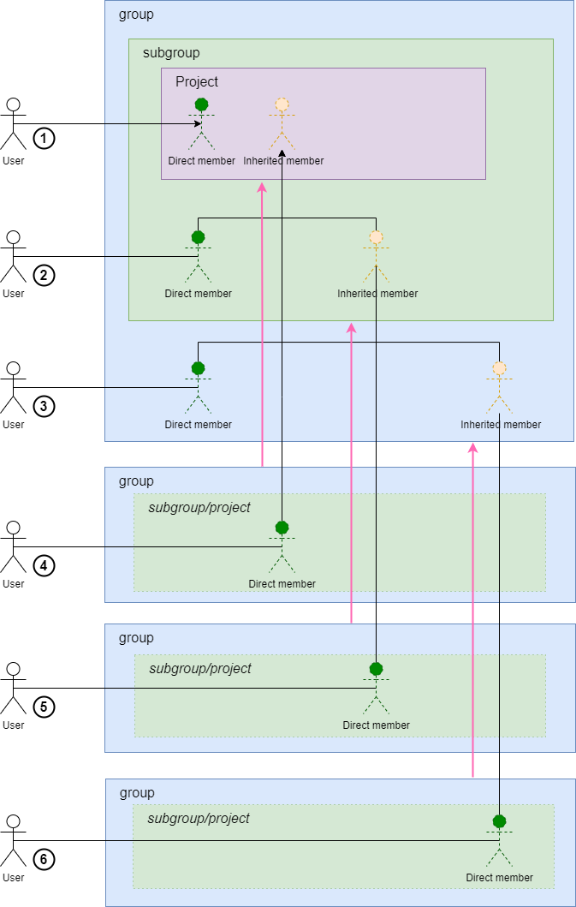
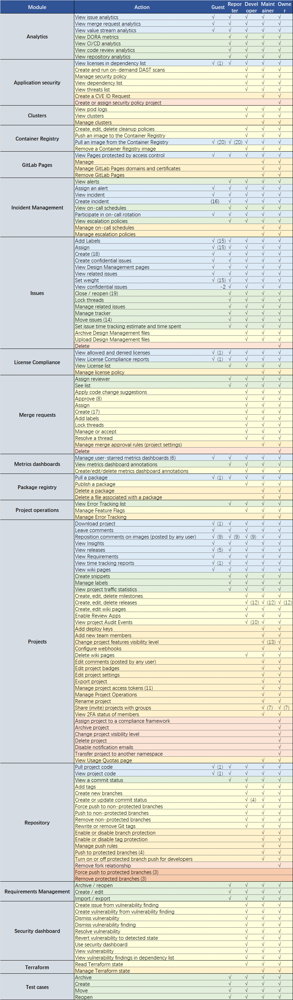

# GitLab学习笔记

## 背景

GitLab从一个本地部署GitHub开始发展为一个功能特性稠密沉重的企业级ALM平台，作为从业者很有必要研究一下。

仅仅是笔记，不是文档；）

## 基础设施

### 选型

对于1k以下的规模，并不需要进行多节点部署，可以直接使用Docker单容器方案，规避了复杂度带来的可靠性下降的问题，实际可以通过快速恢复解决可用性忧虑

> 多节点部署涉及Gitaly集群及其背后的对象存储，HTTP均衡负载等等话题复杂度较高
相关性能和可用性可以参考[https://docs.gitlab.com/ee/administration/reference\_architectures/1k\_users.html](https://docs.gitlab.com/ee/administration/reference\_architectures/1k\_users.html)

### 部署

#### 环境准备

安装简单的Docker非常容易，请参考[https://docs.docker.com/engine/install/](https://docs.docker.com/engine/install/)

> 为了加快速度推荐使用Docker镜像或为其设置http代理
>
> 如果是在Window本机搭建测试环境，可以选择docker desktop版本，结合WSL2也非常方便。
>
> 建议选择Ubuntu+Windows terminal+Oh My Zsh作为终端，后者提供了Docker插件使用方便快捷
不妨安装Portainer和作为Docker可视化管理界面，它同时提供了基本的监控功能省去了配置prometheus的麻烦。

```bash
docker volume create portainer_data
docker run -d -p 8000:8000 -p 9443:9443 --name portainer --restart=always \
           -v /var/run/docker.sock:/var/run/docker.sock \ 
           -v portainer_data:/data portainer/portainer-ce:2.11.1
```


#### GitLab安装

GitLab单容器部署极为简单，可以直接使用引擎命令或者Compose [https://docs.gitlab.com/ee/install/docker.html#install-gitlab-using-docker-engine](https://docs.gitlab.com/ee/install/docker.html#install-gitlab-using-docker-engine)

```bash
sudo #基本安装
docker run --detach
--hostname gitlab.example.com
--publish 443:443 --publish 80:80 --publish 22:22
--name gitlab
--restart always
--volume $GITLAB_HOME/config:/etc/gitlab
--volume $GITLAB_HOME/logs:/var/log/gitlab
--volume $GITLAB_HOME/data:/var/opt/gitlab
--shm-size 256m
gitlab/gitlab-ee:latest
##日志
sudo docker logs -f gitlab
##密码
sudo docker exec -it gitlab grep 'Password:' /etc/gitlab/initial_root_password
```

#### 网络相关


#### 改变URL

[https://docs.gitlab.com/omnibus/settings/configuration.html](https://docs.gitlab.com/omnibus/settings/configuration.html)

### 备份恢复

#### 备份

GitLab自带备份机制，支持热备份和增量备份，在docker单container的情况下较为简单

```bash
##全备份
docker exebas <container name> gitlab-backup create
##增量备份
docker exebas <container name> gitlab-backup create INCREMENTAL=yes
```

备份存档保存在文件backup\_path中指定的 中 config/gitlab.yml。文件名是\[TIMESTAMP]\_gitlab\_backup.tar，其中TIMESTAMP标识每个备份的创建时间，加上 GitLab 版本。如果您需要恢复 GitLab 并且有多个备份可用，则需要时间戳。

例如，如果备份名称为1493107454\_2018\_04\_25\_10.6.4-ce\_gitlab\_backup.tar，则时间戳为1493107454\_2018\_04\_25\_10.6.4-ce。

**同时需要注意，从安全角度考虑该机制没有备份config文件夹数据，需要额外手动进行备份**

GitLab同时支持旧文件删除，后者需要配置/etc/gitlab/gitlab.rb

```ruby
gitlab_rails['backup_archive_permissions'] = 0644 # Makes the backup archives world-readable
```

#### 恢复

在准备了同样的环境后，首先需要手工恢复config相关文件，至少需要恢复/etc/gitlab/gitlab-secrets.json 和/etc/gitlab/gitlab.rb，之后使用GitLab恢复命令即可恢复

```bash
## Stop the processes that are connected to the database
docker exec -it <name of container> gitlab-ctl stop puma
docker exec -it <name of container> gitlab-ctl stop sidekiq
## Verify that the processes are all down before continuing
docker exec -it <name of container> gitlab-ctl status
## Run the restore. NOTE: "_gitlab_backup.tar" is omitted from the name
docker exec -it <name of container> gitlab-backup restore BACKUP=11493107454_2018_04_25_10.6.4-ce
## Restart the GitLab container
docker restart <name of container>
## Check GitLab
docker exec -it <name of container> gitlab-rake gitlab:check SANITIZE=true
```


## 用户和项目权限管理

### 基本问题

可能是由于从开源社区方案演进到企业级的历史包袱，GitLab的权限系统缺乏一以贯之的权限模型，极为庞杂。相关概念包括：

* 全局权限
* 项目可见性等级（Public/Internal/Private）
* 项目和组权限继承和共享
* 项目权限
    * wiki/issue
    * CI/CD
    * 仓库权限
    * 其他
* 组管理权限
* 各种其他权限补丁（External User/Free Guest User/Auditor User/Users with minimal access）

### 全局权限

### 项目可见性

项目可见性约定了是否项目可以内部或外部公开，这对对于**显示配置**企业级场景用处不大

### 项目和组权限继承和共享

#### 基本要素

和通常的ALM工具使用账户树和Project扁平结构映射角色权限不同，GitHub的权限带有很强的约定大于配置设计风格。组成基本权限的要素有：

* 用户账户（user）
* 成员（member）
* 项目（project）
* 组和子组（group/subgroup）
* 角色（role）
* 共享（shared）

#### 特殊要素

GitLab具有一些全局性的固定外部要素，这些要素仅External User可以在CE 本地部署可用，其余均需要付费授权

* External User
* Free Guest User
* Auditor User
* Users with minimal access

#### 人员结构

user通过role进入group、subgroup或project中映射为member，显而易见的，这些member分为Direct member和Inherited member，通过以下规则形成树状关系

* group/subgroup-project关系
* group-subgroup关系

> **需要注意，之后我们将看到shared关系并不构成人员结构，共享无法传递。**

### 访问权限传递

#### 非共享访问

非共享访问即集成访问，一个Project除了其direct member（1）外，其上游各个subgroup（2）和group（3）的direct member会通过inherited member逐级下渗，角色保持不变。

#### 共享访问

通过将project直接共享给group/subgroup（4）或将project的上游group/subgroup共享给group/subgroup（5）（6），user也可以获得member权限，权限传递遵循以下原则

* 共享源（被共享方）服从非共享传递规则，即外来共享目标成为inherited member后同样逐级下渗
* 共享目标（分享者）仅遵循人员结构原则，即仅将共享目标的group/subgroup的direct member与其下属的所有group/subgroup/project的direct member作为共享目标
* 传递中会受到共享源最大角色的设定限制



### 角色和权限

GitLab属于预置角色模型，开源提供了几种基本角色，即：

* Guest
* Report
* Developer
* Maintainer
* Owner/Admin

在官方手册中给出了基本定义 [product handbook on permission](https://about.gitlab.com/handbook/product/gitlab-the-product/#permissions-in-gitlab)整理后图表见下：




## 代码提交和合并

### 分支模式

#### 背景

git存在多种经典的分支模式

##### git-flow

于2010年左右提出的经典git模型，存在长期分支master和develop ，工作分支feature和hotfix以及发布分支release，模型完整自洽，较为繁琐。

相关实现：[https://github.com/petervanderdoes/gitflow-avh](https://github.com/petervanderdoes/gitflow-avh)

>这个模型实际较为古老，可以上述到CVS是时代乃至更早的开源社区，提交独立而分治的思想在提交者具有很好的面向合并的工作意识的前提下非常灵活，但在商业环境下，这一点可能会导致分而不治的情况出现


##### github-flow

由github提出的模型，基本思想为master随时可用，工作分支扁平，体现了CI/CD的核心思维。会发生官方文档： [https://docs.github.com/en/get-started/quickstart/github-flow](https://docs.github.com/en/get-started/quickstart/github-flow)


>如果系统确实无法拆分而形成复杂的依赖代码组织的编译前架构，过于扁平的工作分支会带来混乱。


#### Gitlab Flow

gitlab-flow基本遵循github-flow思想，但为了适应具有计划性的发布要求，增加了预发布和发布分支。

同时，gitlab也支持feature分支[https://docs.gitlab.com/ee/topics/git/feature\_branch\_development.html](https://docs.gitlab.com/ee/topics/git/feature\_branch\_development.html)


### 合并请求

#### 背景

合并请求（Merge Request MR）用于进行代码提交前检查（Pre-Commit Code Reviews），该功能在非分布式版本控制工具中以Patch方式提交和检查，但无法应对多次提交等情况，这一状况随着git/gerrit的出现的得到完美解决。

#### 基本概念

MR即在GitLab上一个从A分支到B的合并请求，一般而言，B分支为受保护分支（Protected Branch），不允许直接推送

首先 需要注意，可能因为合并请求（Merge Request）是以code为中心的Gitlab方案的核心功能，此功能成为版本差异的重灾区，大部分企业级的细致管控需求均需要付费版本支持。

aadd

