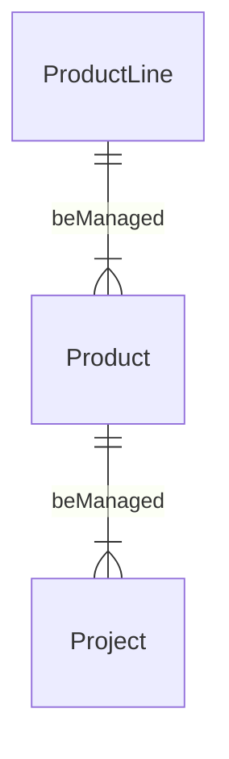
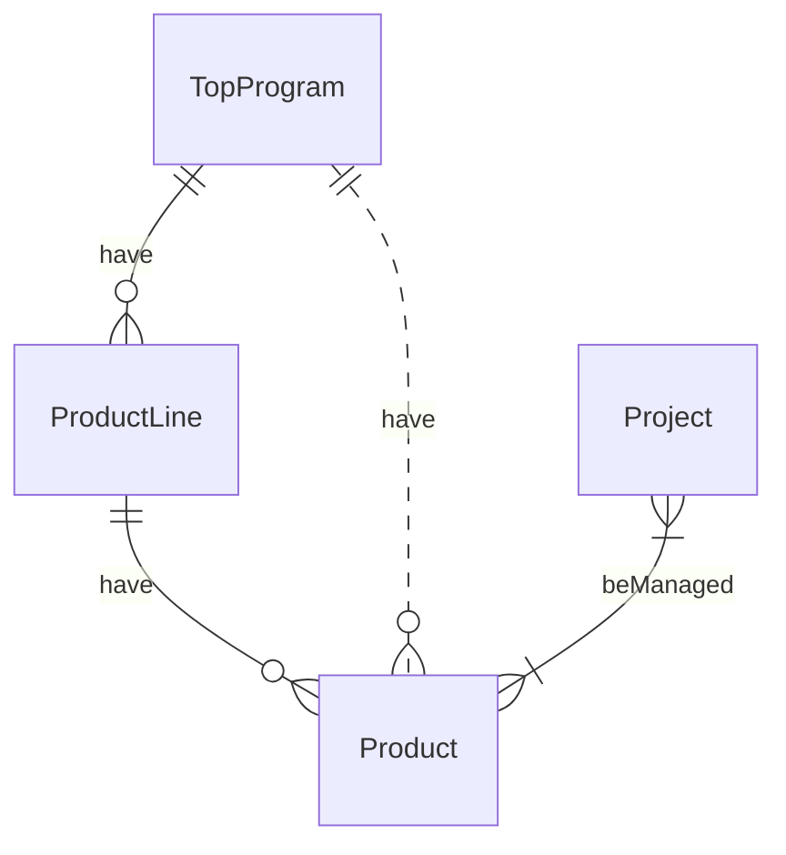
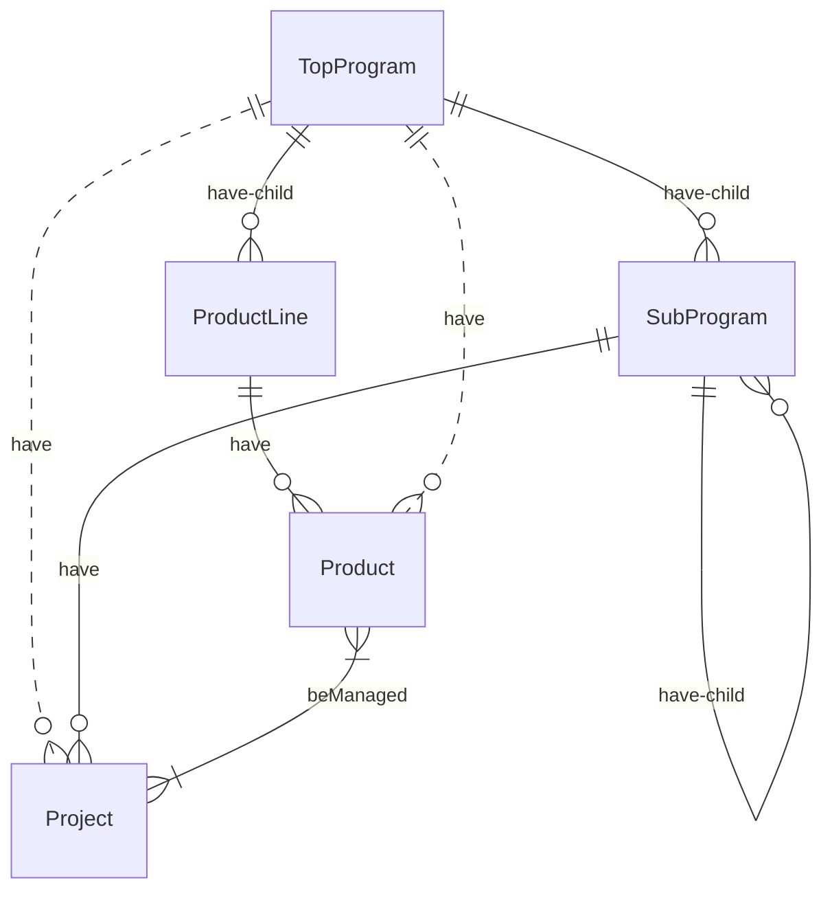
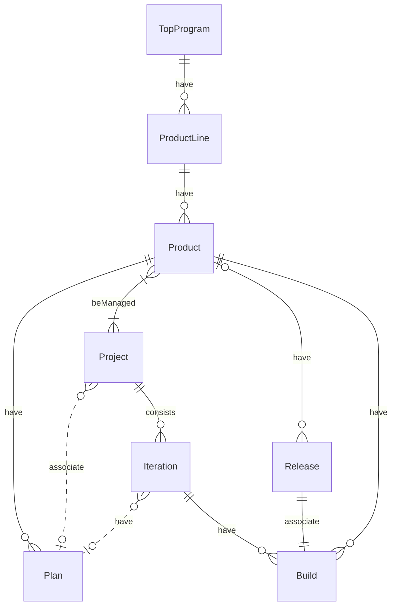
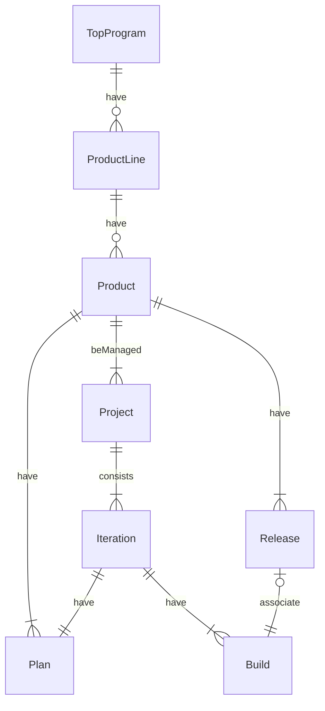
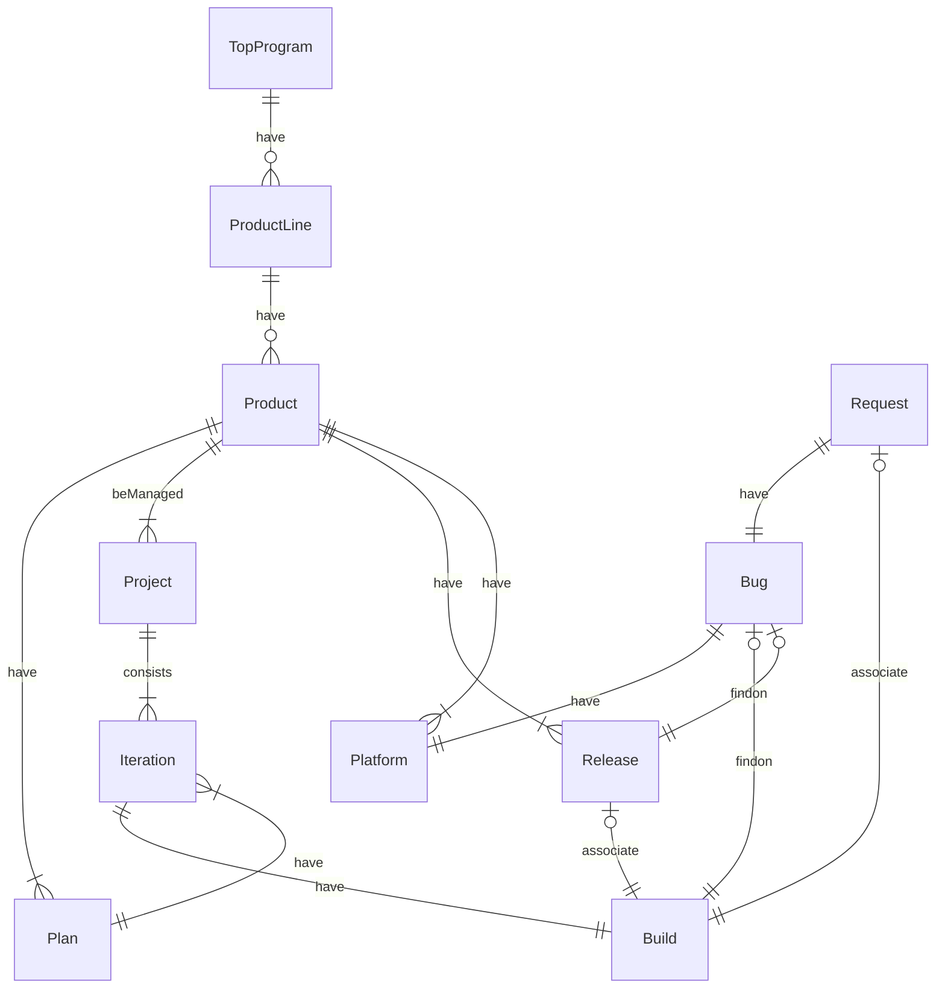

# 禅道端到端模型探讨

## 背景

禅道作为老牌国产ALM，既有高于同级别工具（如Redmine/JIRA）的全流程管控（如产品管理/测试执行管理）又在元模型和工作流上不具有基本的可定制性，非常非常有特色。以下就如何规避工具固有的复杂度实现端到端交付的目标，做一些探讨。

### 基于看板的端到端管理模式

与传统的瀑布或V模型不同，端到端交付更为简单明晰，适用于业务性开发，其主要特点和目标是：


> 禅道版本庞杂，此笔记以16.5开源版本作为基础进行分析，也会提示一些付费版本以及早期版本的差异

### 禅道的基础设施

#### 部署

禅道是PHP架构的B/S系统，亦支持Docker一下

```shell
sudo docker run --name zentao -p 81:80  -v /srv/zentaopms:/www/zentaopms -v /srv/mysqldata:/var/lib/mysql -e MYSQL_ROOT_PASSWORD=123456 -d easysoft/zentao:16.5
```

#### 备份恢复机制

禅道支持多种备份恢复机制，如

- 通过Web控制台在系统内部定义备份，包括周期、方式和保留周期等
- 通过外部脚本从PHP框架命令行接口进行备份

## 一些提示

禅道的交互性设计并不尽如人意，以下做一些备忘

- 帮助文档很可能是有问题的，请浏览其下用户提问和回答
- 需要浏览所有的对象，如所有产品对象，方法是进入板块后再次点击板块左上角产图标
- 时刻注意左上角面包屑提示，尤其在多平台场景下
- 一些操作模式较为费解的情况
  - 产品模块在产品设置界面具有维护入口，迭代模块不具有此入口

## 项目和产品管理基本模型

项目和产品管理是指项目集、产品和项目的关系，其中禅道还继承了早期版本的产品线元素，以下列举了各种管理模式

>  原则上这些模式虽然可以混杂使用，但会增加整体管理难度。

### 孤儿模型



孤儿模型是最简单的模型，在早期无项目集的禅道版本均属于此类情况，其特征是

- 产品和项目不关联项目集（等同于项目和产品都属于项目集根”/“）
- 项目和产品之间为多对多关系，项目可以被多个项目实现，反之亦然
  - 实际应用需要明确映射策略，而非随意映射

- 产品线问题
  - 产品线为从属于任意顶级项目集一维列表，类似于产品分类
  - 由于产品线必须关联一个顶级项目集，故此处产品线不可用
  - 在早期版本中，产品线成为可选择的顶级管理元素

### 极简模型



极简模型在孤儿模型的基础上增加了顶层项目集，其特点为：

- 项目通过产品获得顶层项目集，反之亦然
- 多产品项目中，各产品应该属于同一顶层项目集
- 可选择使用产品线增加产品的组织，获得顶层项目集-产品线两级产品组织

### 复杂模型



在禅道中项目集元素如果仅仅存在于简单模型中，则其应该叫做产品集合，实际上项目可以进一步从属于子项目集，形成以上复杂的关系：

- 需要注意，禅道中项目集和大多数其他父子元素对不同，并不存在顶层项目集和子项目集的区别，以上称呼仅仅描述其在项目集树中的位置
  - 项目可以关联顶级项目集和任意子项目集

- 项目和子项目集的映射应该符合其和产品的映射，即其关联的项目集应该位于其关联的产品的顶层项目集下，反之亦然
- 在这个复杂模型中产品组织保持不变

## 计划、迭代、版本和发布模型

### 混乱的禅道基础模型

计划、迭代、版本和发布可以视为产品和项目下对研发需求的分组，其中计划和发布属于产品过程另外两者属于项目过程。以下以极简模型为基础讨论：




可能是处于兼容多种使用模式，禅道的映射关系复杂混乱，需要注意：

- 研发需求和除了计划以外的分组的关系是多对多的即一个需求可以同时出现在多个迭代、版本或发布中
- 计划向下的流转是一对多的，即可以把一个计划分配到不同的迭代中，反之则不可
  - 这种映射关系不是强关系，如将计划-迭代映射关系并不意味着其中研发需求会同步，甚至也不意味着迭代不可以实现其他计划的研发需求👎
  - 所以计划和版本是非常弱的关联关系，需要人工在使用上进行约束
- 由于项目-产品关联关系为多对多，故Release和Build没有直接匹配关系，二十通过Product进行映射约束并人工选择建立一对一关联
- 计划和研发需求均可以形成一级的父子关系，此时父计划或父研发需求无法进行映射或流转

### 计划单迭代模型




这个模型的特点是：

- 项目不跨产品，即产品仅由一个或几个专门服务其产品的项目承载
- 产品计划和迭代一对一关系，产品计划即迭代计划，通过“按照计划关联”的功能保持需求同步
- 计划/迭代内由版本作为演进对象实施测试
- 成熟版本即可发布

### 计划多迭代模型


在计划单迭代模型的基础上，在迭代内部进一步拆分计划需求形成此模型，特点是：

- 对于较大的产品计划可以进一步由研发团队拆解为内部迭代，带来一定自主性
- 拆解过程和产品关系较为模糊，如果不体现产品价值则进度价值模糊，反之则可直接由产品进行更细致的计划安排即可

## 用户需求和研发需求

用户需求、研发需求属于产品的主要输出物，后者会按照计划-迭代一路向下流转分配

### 用户需求过程

用户需求属于默认关系元素，可以在后台配置打开，和研发需求一样

### 研发需求流转需求

## 用户需求、研发需求、用例、测试单和缺陷


## 模块和平台/分支模型

### 产品和项目模块

产品和项目都具有模块元素，其主要特征是

- 产品模块在所有下游通用
- 项目模块仅存在于迭代上下文中，仅被迭代中的任务所使用

### 平台/分支

平台或分支是产品级可以增加的层次，其特点为：

- 产品可以视情况使用两者中的一个，使用方式完全相同（以下以平台作为例子）
- 平台为一维列表，没有进一步形成树状关系
- 在有平台的情况下，对产品的引用均需要指定平台
- 系统默认分配主干平台作为不关闭的平台
  - 任何平台均不可删除

可以想象，如果结合禅道固有的产品和相互多对多关系，平台的引入将进一步加剧混乱，所以与产品和项目管理基本模型中一样，我们需要设置策略对此进行约束

### 跨平台开发模式

跨平台开发模式中，产品和研发仅仅需要非常有限的考虑跨平台差异，仅会由非常少量的需求和相应的任务以及测试用例关联非主干版本，而测试执行则需要在不同平台上依次执行



主要问题和特征

- Bug上使用产品关联进行平台区分，这需要相应的项目和迭代都全盘继承所有产品中的平台
- 其他各个过程基本不进行平台区分管理
- 如果一个版本已经发布，Bug只能关联其所关联的发布

### 多平台分别开发模式

多平台开发模式中，主干需求基本相同，而平台实现则有较大差异，如同时开发桌面端和移动端的情况，可能需要分别进行UE/UI设计


### 多客户分支模式

实际为需求、用例和代码复用

### 多平台多可能分支模式


## 项目管理过程

### 各要素状态流转

### 进度管理

### 成本收集

## 需求流转

## 用例、测试执行和缺陷管理

## 代码平衡和持续构建

## 安全与权限


