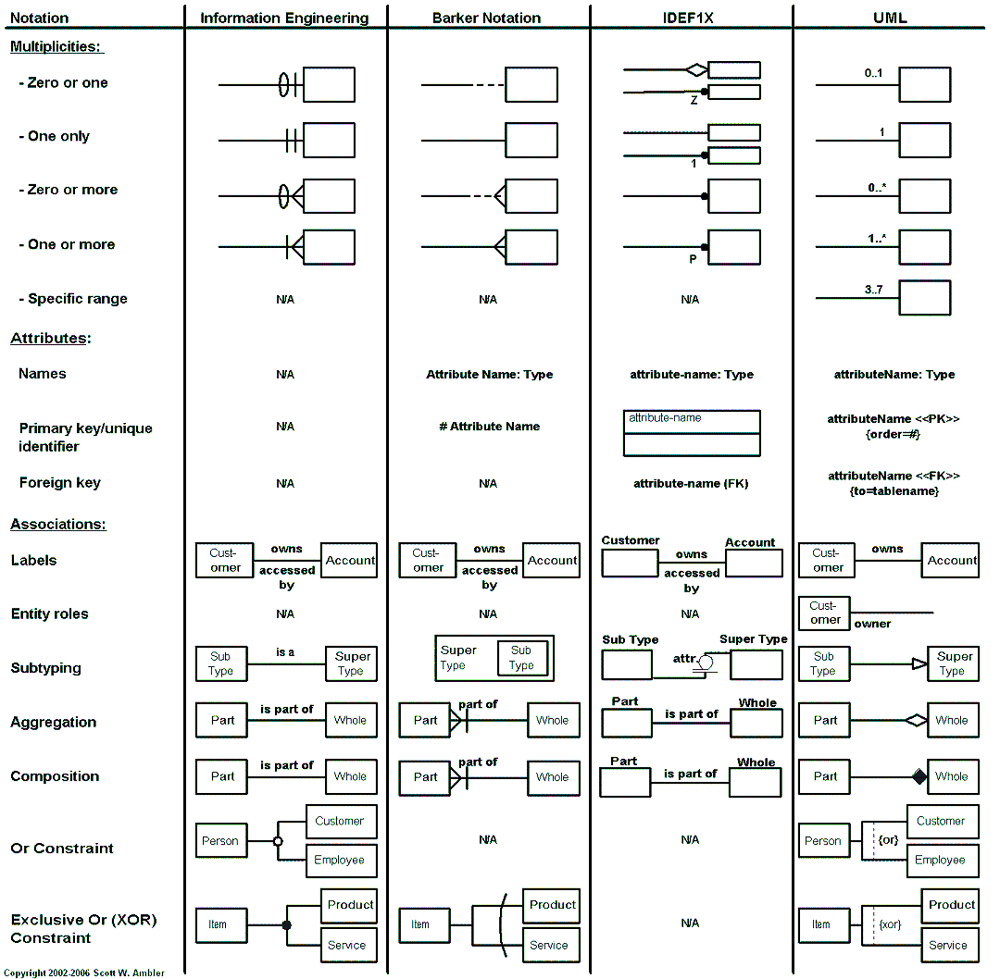
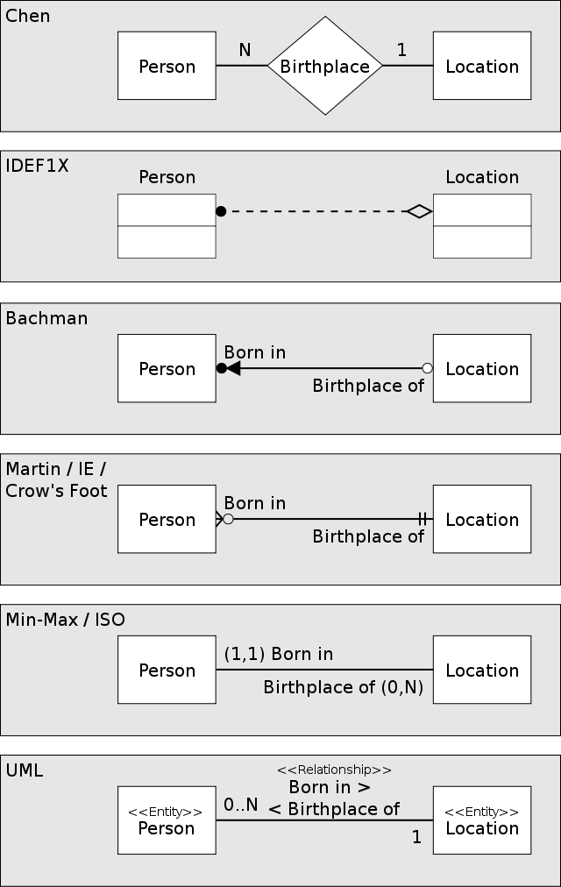
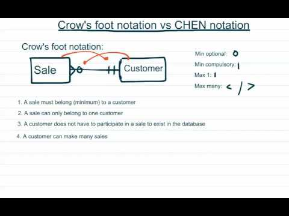
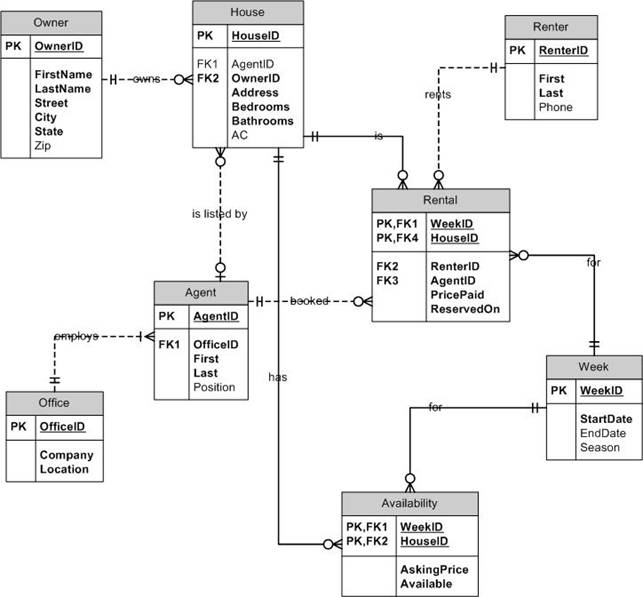
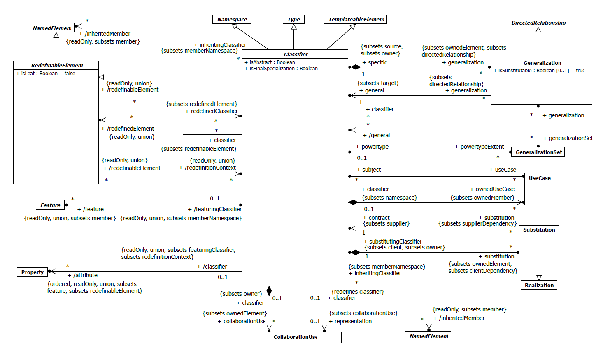
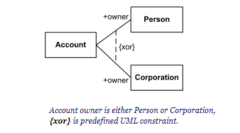

# ER Diagram

## 面向产品和架构的ER图

和从产品和架构角度看，更注重数据业务逻辑关系而非实现关系，由此

- 探讨和明确业务结构
- 梳理和检查系统内部数据逻辑自洽性，构建数据闭环
- 考虑扩展性并评估由此带来的数据复杂度
- 不考虑实际落地关系，如关系数据库关联表或非关系数据库话题

所以和面向研发的ER图不同，此时仅需要画图工具如draw.io、Visio等等，并不需要带有数据支撑的工具

## ER图风格

在[Wikiwand](https://www.wikiwand.com/en/Entity-relationship_model)相关条目记载了软件工程先驱们发明了各式各样有趣的画法，大浪淘沙目前较为流行的主要是以下两种风格，实践中可以灵活选择并混合使用；）

### Crow's foot /IE

Crow's foot 历史悠久而抽象简明，由三种Foot符号对Max和Min进行约定，形成4种关系

传统的风格中没有定义连接方向和描述，也没有定义属性（attribute），无法进一步扩展成落地关系数据库设计，但很多时候也可以将其扩展

### UML/SYSML风格

UML包罗万象博大精深，ER图仅仅是其类图中的Relationships-Association，数据实体关联关系直接使用数学符号表示（1、0、n/*/^）和Crow‘s foot notation相比，更为容易理解。然而UML进一步增加了丰富而费解的修饰元素

- 导向箭头和叉号，用来标识数据流向
- 聚合与组合
- 角色和association end

详情可以参考[UML/2.5.1/PDF](https://www.omg.org/spec/UML/2.5.1/PDF)，工具可以参考[Gaphor](https://gaphor.org/)

### OR XOR

当关系存在选择或互斥的情况，则需要指出其逻辑关系

